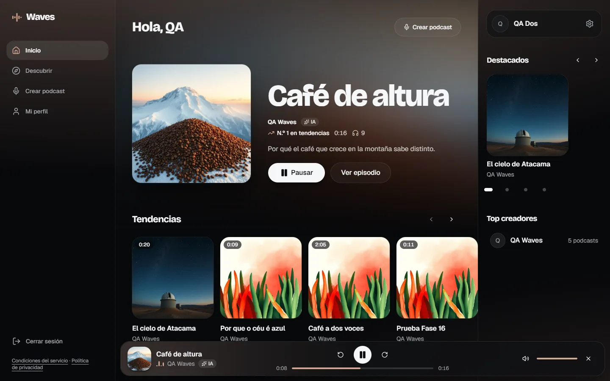
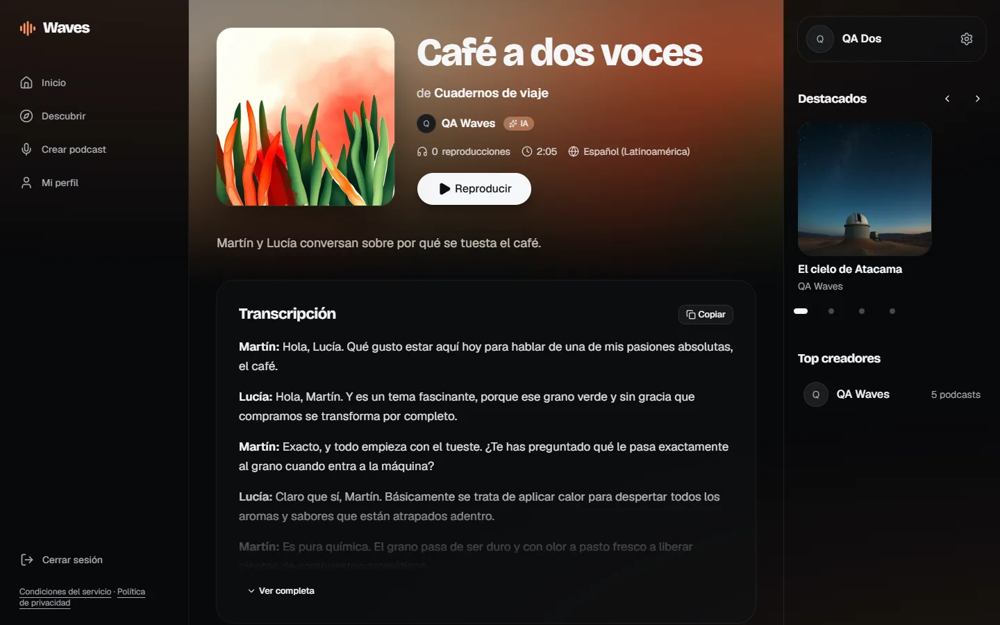
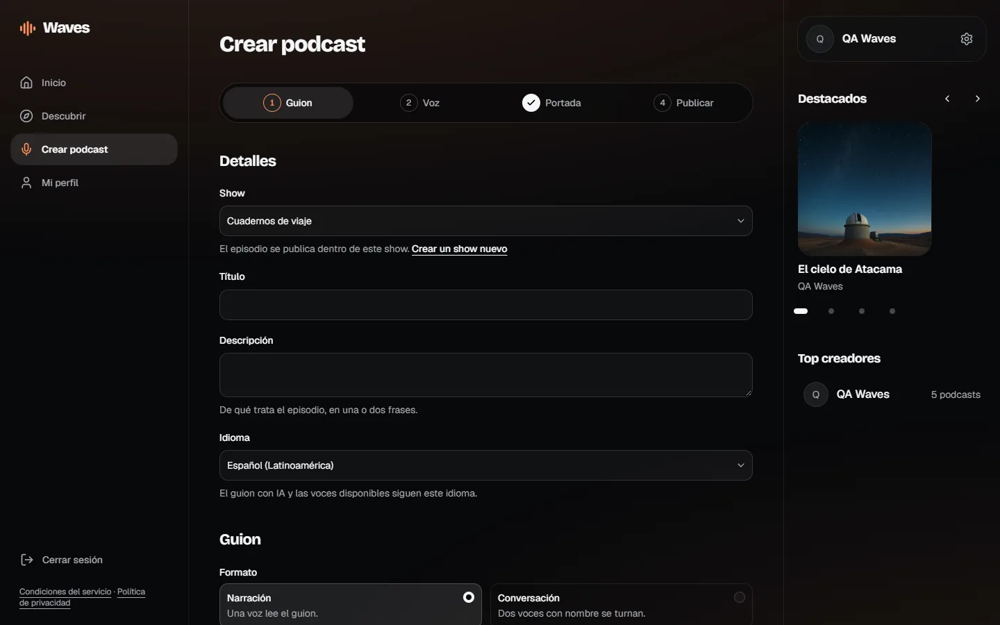
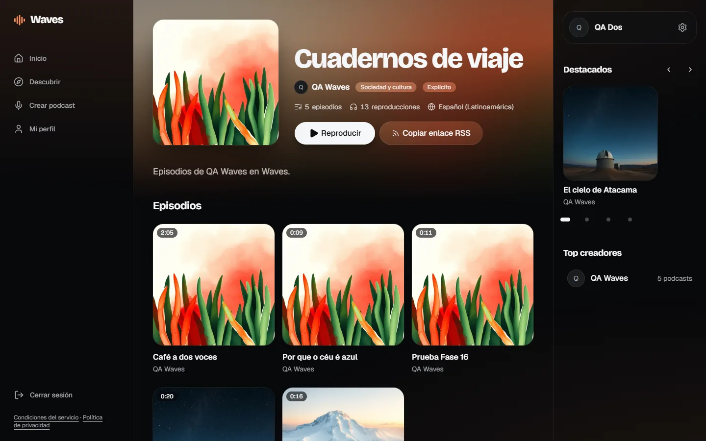
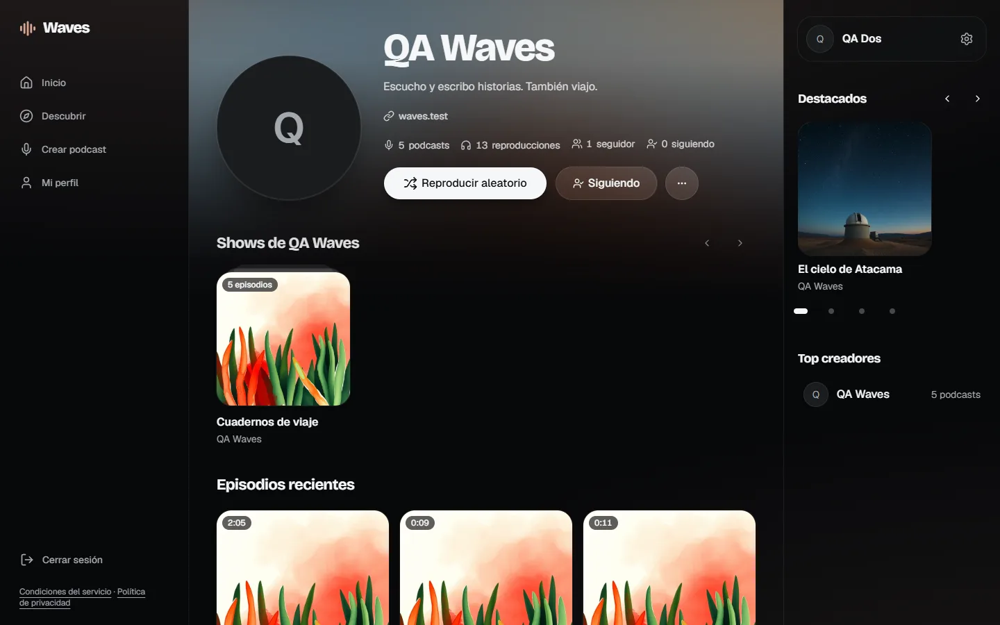
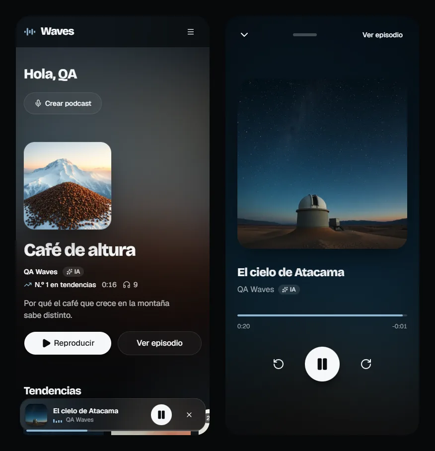

# Waves

Plataforma para crear, alojar y escuchar podcasts generados con IA, sin grabar una sola voz humana. Escribes o generas un guion, eliges voz e idioma, la app produce el audio con text-to-speech, creas una portada con IA o la subes, y publicas el episodio dentro de un show con su propio feed RSS. Los oyentes descubren, buscan y escuchan con un reproductor que no se corta al navegar.

**En producción:** https://waves-podcasts.vercel.app



## Qué hace

**Crear**

- Guion escrito a mano o generado con IA a partir de un tema, una duración y un tono.
- Dos formatos: narración con una voz, o conversación entre dos anfitriones con nombre que se turnan.
- Voces Chirp 3 HD en español (Latinoamérica y España), inglés y portugués, con tres velocidades.
- Portada generada con IA o subida por el usuario. Si el episodio no trae portada, usa la de su show.
- Aviso hablado de IA opcional al inicio del audio. Todo episodio se marca como "Voz generada con IA".

**Escuchar**

- Reproductor persistente que sigue sonando al cambiar de página, con vista expandida "Ahora suena" en móvil.
- La portada que suena tiñe toda la interfaz con su color (modo ambiente).
- Transcripción completa en cada episodio, separada por anfitrión en las conversaciones.

**Distribuir**

- Cada show tiene un feed RSS 2.0 con etiquetas de iTunes y Podcasting 2.0, válido en el W3C Feed Validator y listo para enviar a Apple Podcasts y Spotify.
- Transcripciones descargables en `.txt` y `.vtt`, portadas de 1400 px para directorios y audio servido con su tamaño real.

**Descubrir y comunidad**

- Tendencias, shows populares, episodios recientes y búsqueda por título, creador o show.
- Perfil editable: nombre visible, foto, bio y enlace.
- Seguir cuentas, ver seguidores y seguidos, y una fila "De quienes sigues" en Inicio.
- Bloquear: corta los follows en ambos sentidos y, con sesión, cada cuenta deja de ver el contenido de la otra.

## Capturas

| Detalle de un episodio a dos voces                                                                              | Formulario de creación por etapas                                                                      |
| --------------------------------------------------------------------------------------------------------------- | ------------------------------------------------------------------------------------------------------ |
|  |  |
| **Página de un show con su feed RSS**                                                                           | **Perfil de un creador**                                                                               |
|       |            |

<p align="center">
  
</p>

## Stack

| Capa          | Tecnología                                                                                   |
| ------------- | -------------------------------------------------------------------------------------------- |
| Frontend      | Next.js 16 (App Router), React 19, TypeScript estricto                                       |
| Interfaz      | Tailwind CSS v4, shadcn/ui, Motion, Zustand (estado del reproductor)                         |
| Formularios   | React Hook Form + Zod, con las mismas reglas que valida el servidor                          |
| Backend       | Convex: base de datos, queries y mutations, actions, file storage, búsqueda full-text, crons |
| Autenticación | Convex Auth (Google y email con contraseña)                                                  |
| Voz           | Google Cloud Text-to-Speech, voces Chirp 3 HD                                                |
| Portadas      | Cloudflare Workers AI, FLUX.1 schnell                                                        |
| Guion         | Gemini API                                                                                   |
| Despliegue    | Vercel (frontend) y Convex (backend)                                                         |

## Arquitectura

```
Navegador ── Next.js en Vercel ──── queries y mutations reactivas ───► Convex
                │                                                     │
                └ feed RSS, portadas y audio para directorios         ├─ base de datos y búsqueda
                                                                      ├─ file storage (audio, portadas, fotos)
                                                                      ├─ crons (limpieza de archivos huérfanos)
                                                                      └─ actions ──► Google TTS · Workers AI · Gemini
```

- Toda llamada a un proveedor de IA ocurre en una action de Convex. Las claves viven en variables de entorno de Convex y nunca llegan al cliente.
- Cada función pública valida sus argumentos. Las que escriben datos o gastan IA verifican la sesión, y las que modifican un show o un episodio verifican que el usuario sea su autor.
- La base de datos guarda ids de archivos, no URLs: las queries las resuelven al leer.
- Cuotas diarias por usuario para audio, portadas y guiones, un tope global mensual de caracteres de TTS y límites por hora para registros, perfiles, follows y reproducciones.

## Costo cero

Todo corre en capas gratuitas: Vercel Hobby, Convex Free, Gemini API sin facturación, Cloudflare Workers AI dentro de su cuota diaria y Cloud Text-to-Speech dentro del millón de caracteres mensuales de Chirp 3 HD. La app impone sus propios límites por debajo de esas cuotas.

## Desarrollo local

Requisitos: Node.js 24 LTS y cuentas gratuitas de Convex, Google Cloud, Google AI Studio y Cloudflare.

```bash
npm install
npx convex dev        # crea el deployment de desarrollo y escribe .env.local
npm run dev           # en otra terminal: http://localhost:3000
```

Las claves del backend se configuran en Convex, no en `.env.local`:

```bash
npx @convex-dev/auth                              # SITE_URL, JWT_PRIVATE_KEY y JWKS
npx convex env set AUTH_GOOGLE_ID <id>            # callback: https://<deployment>.convex.site/api/auth/callback/google
npx convex env set AUTH_GOOGLE_SECRET <secret>
npx convex env set GOOGLE_TTS_API_KEY <key>       # proyecto de Google Cloud con facturación, solo la API de TTS
npx convex env set CLOUDFLARE_ACCOUNT_ID <id>
npx convex env set CLOUDFLARE_API_TOKEN <token>   # permiso de Workers AI
npx convex env set GEMINI_API_KEY <key>           # proyecto de AI Studio sin facturación
```

La plantilla completa está en `.env.example`.

| Script              | Qué hace                                                |
| ------------------- | ------------------------------------------------------- |
| `npm run dev`       | Next.js en modo desarrollo                              |
| `npx convex dev`    | Sincroniza las funciones de Convex y regenera sus tipos |
| `npm test`          | Tests de la lógica pura con Vitest                      |
| `npm run typecheck` | Tipos de rutas de Next.js y `tsc --noEmit`              |
| `npm run lint`      | ESLint                                                  |
| `npm run format`    | Prettier                                                |
| `npm run build`     | Build de producción                                     |

## Calidad

- 113 tests de Vitest sobre la lógica compartida entre cliente y servidor: reglas de formularios, parser de conversaciones, feed RSS, subtítulos VTT, audio y ocultamiento por bloqueos.
- Accesibilidad 100 en Lighthouse en todas las rutas públicas, verificada también con axe en los estados con sesión; foco visible, objetivos de 44 px y `prefers-reduced-motion`.
- Feed validado con el W3C Feed Validator.

## Estado

Proyecto terminado: las 23 fases del plan están en producción. Quedaron fuera, por costo o alcance, los pagos, la clonación de voces, la generación asíncrona de episodios largos, las estadísticas avanzadas, el modo claro y la internacionalización de la interfaz.

## Autor

Alonso Vera (Rickety Major)
